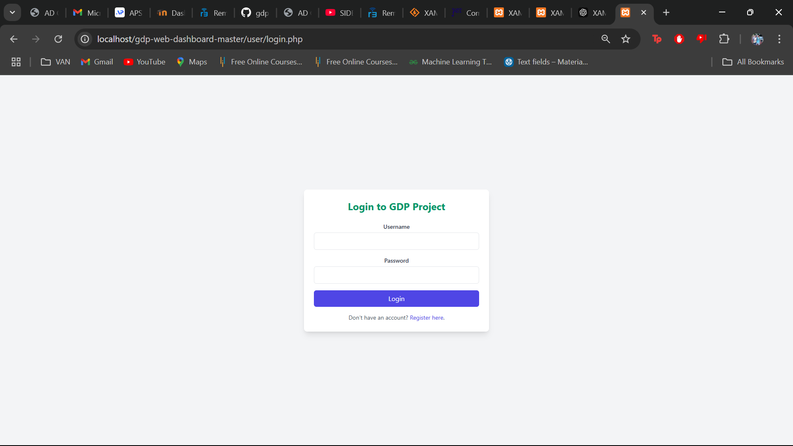

# GDP Project Dashboard

## Screenshots

### Login Page

This screenshot shows the **login page** where users can enter their credentials to access the GDP project dashboard. The interface is simple and user-friendly.

### Login Page (Alternate)

An alternate view of the **login page**, showing different styling or layout options for the user login interface.

### Plant Analysis

This screenshot shows the **plant analysis page** where users can monitor the health of plants. The dashboard visualizes various plant parameters and helps identify potential issues such as disease, water deficiency, or environmental stress.

### User Registration

This screenshot displays the **user registration page**, where new users can sign up to access the GDP project dashboard. It collects essential information such as name, email, and password for user authentication.

### Registration Example

An example of the **registration form** filled out, providing a reference for users to understand the required information for account creation. This helps guide new users during the registration process.

### User Dashboard

The **user dashboard** provides an overview of the user's data and activities, including plant health, water quality, and other relevant metrics. Users can interact with various features through this page, track progress, and monitor the system.

### Water and Fish Analysis

This screenshot shows the **water and fish analysis page**, where the system provides insights into water quality and fish health. It helps users manage their aquatic environment and ensure the well-being of fish and other aquatic life.

### Admin Dashboard

The **admin dashboard** offers administrative features for managing users, viewing system data, and overseeing the overall functionality of the GDP project. Admins have additional access to manage settings, monitor user activity, and maintain system operations.

---

### Overall Project Description:
The **GDP Project Dashboard** serves as a comprehensive platform for monitoring environmental data related to plants and aquatic life. It provides insights through an intuitive interface designed for both general users and administrators. This dashboard helps users track plant health, water quality, and fish numbers, while administrators manage user access and system settings.
